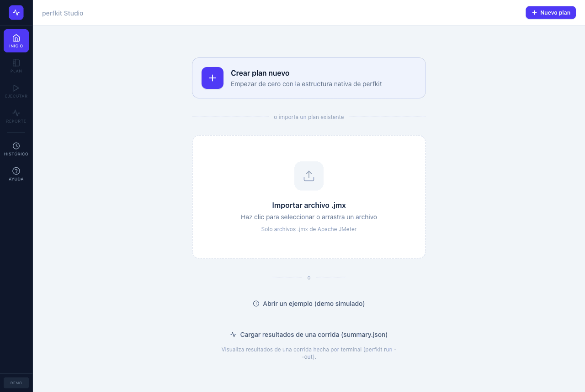
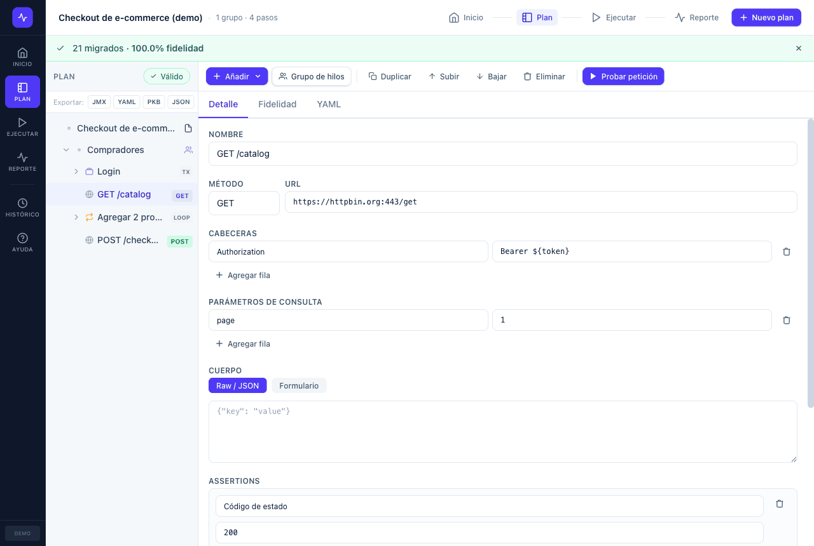
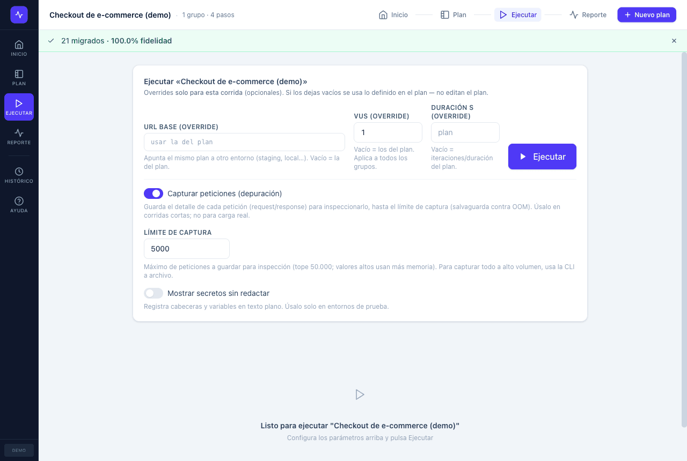
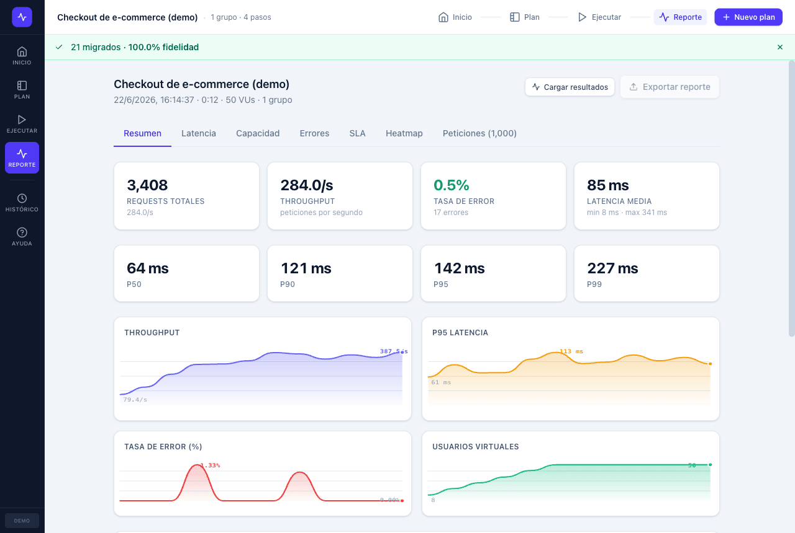
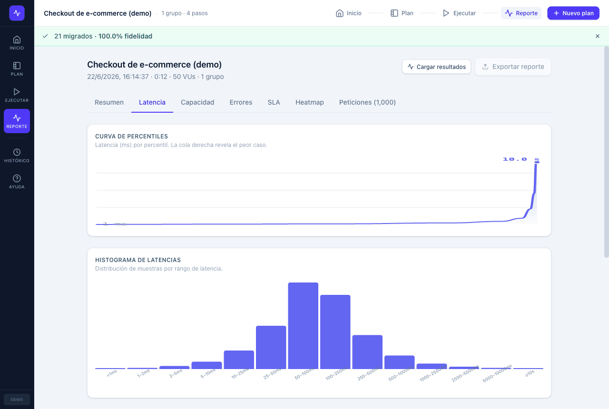
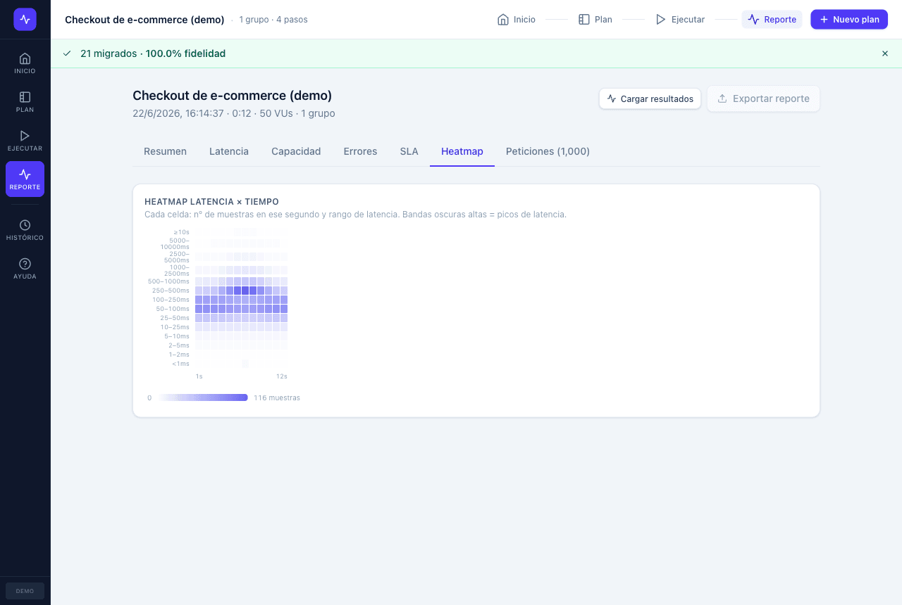
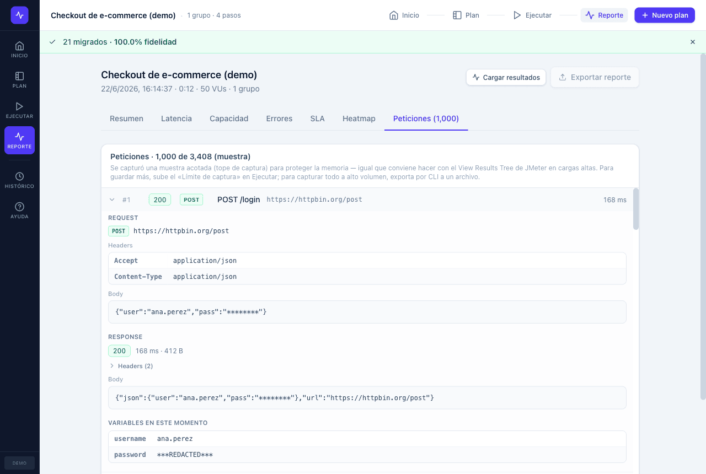

# perfkit

Suite moderna de **performance testing** con un camino de migración creíble desde **Apache JMeter**: importa tu `.jmx`, entiende qué migró y qué no, ejecútalo localmente y obtén un reporte que reconoces — sin reescribir todo. CLI para terminal/CI y **app nativa** para QA.

> Nombre `perfkit` temporal/renombrable. Open-core (ver `docs/adr/ADR-001`).

## Principio rector

> *"Importé mi JMX, entendí qué migró y qué no, ejecuté la prueba localmente, obtuve un reporte que reconozco y puedo llevar esto a CI sin reescribir todo."*

## Arquitectura

```
JMX ─import─▶ IR canónico (YAML/JSON/PKB) ─run─▶ métricas/percentiles ─report─▶ HTML/JSON/JUnit
       │ reporte de fidelidad                      (motor Rust/Tokio)            (gate en CI)
       │                                                   │
       └────────────────────────────────────────── exportar ◀─┘ (YAML/JSON/PKB/JMX, ida y vuelta a JMeter)

UI nativa (Tauri + React): Inicio · Plan (crear/editar) · Ejecutar (dashboard live + captura) ·
                            Reporte (pestañas) · Histórico · Ayuda
```

| Crate | Rol |
|---|---|
| `scenario-ir` | Modelo IR canónico + serde + JSON Schema + validador |
| `jmx-importer` | Parser JMX → IR + **reporte de fidelidad** (sin fallos silenciosos) + export IR→JMX |
| `http-adapter` | Cliente HTTP/HTTPS (reqwest/rustls), mide TTFB y latencia total |
| `engine` | Scheduler ramp-up/hold/ramp-down, VUs async, timers, assertions, extractores, captura por petición |
| `metrics` | Histogramas (p50…p99.9), throughput, error rate, series, heatmap, status codes, bytes |
| `reports` | HTML offline / JSON / JUnit + `gate` por thresholds |
| `security` | Secretos y redacción (stub MVP) |
| `kafka-adapter` | Productor Kafka (rskafka) — sampler Kafka (Fase 7) |
| `cluster` | Ejecución distribuida coordinator/worker (Fase 6) |
| `history` | Histórico SQLite, baselines, tendencias, regresión, RBAC, auditoría (Fase 10) |
| `ai-assist` | IA gobernada local/BYOK, redacción, sugerencias revisables (Fase 9) |
| `plugin-host` | Host de plugins WASM firmados (wasmi) (Fase 8) |
| `cli` | Binario `perfkit` |
| `ui/` | App nativa **Tauri 2 + React + TS + Tailwind** |

## Quickstart (CLI)

```bash
cargo build --workspace

# Importar un JMX → IR + reporte de fidelidad
./target/debug/perfkit import jmx examples/jmx/checkout-demo.jmx -o scenario.yaml
./target/debug/perfkit validate scenario.yaml

# Depurar: corrida corta que captura y muestra cada request/response (como el View Results Tree)
./target/debug/perfkit debug scenario.yaml --base-url http://127.0.0.1:3001 --iterations 1
#   --no-redact muestra cabeceras/variables en texto plano

# Ejecutar carga y generar reportes
./target/debug/perfkit run scenario.yaml --base-url http://127.0.0.1:3001 --vus 50 --duration 20 --out reports/run-001

# Quality gate para CI (exit 1 si rompe umbrales)
./target/debug/perfkit gate reports/run-001/summary.json --thresholds examples/yaml/thresholds.yaml
```

### Dónde se guardan los resultados

`perfkit run` escribe en **`reports/<run-id>/`** por defecto (relativo a tu directorio actual), o en el directorio que pases con **`--out <dir>`**. Genera:

| Archivo | Cuándo | Para qué |
|---|---|---|
| `summary.json` | siempre | machine-readable; **se carga en la UI** para visualizarlo |
| `report.html` | `--report html` (o por defecto) | reporte offline, compartible |
| `report.junit.xml` | `--report junit` (o por defecto) | CI |

`perfkit debug` imprime el detalle por **stdout** (no escribe archivos). `perfkit history` usa una base SQLite (`perfkit-history.db`).

## UI nativa

```bash
cd ui && pnpm install && pnpm tauri dev      # desarrollo
# o
pnpm -C ui tauri build                       # binario release
```

Qué puedes hacer en la app (sin escribir código):

- **Inicio:** crear un plan desde cero, importar un `.jmx` (con reporte de fidelidad), abrir un **ejemplo ejecutable** (checkout contra `httpbin.org`) o **cargar resultados** de una corrida de terminal (`summary.json`).
- **Plan:** construir/editar el árbol nativo (grupos de hilos, controladores, HTTP, timers, assertions, extractores, variables) y **probar una sola petición** mientras construyes.
- **Ejecutar:** overrides por corrida (URL base/VUs/duración), **dashboard en vivo** y **captura de peticiones** para inspección (request/response, variables, redacción de secretos con flag de texto plano y **límite de captura** configurable).
- **Reporte (pestañas):** Resumen · **Latencia** (curva de percentiles, histograma, TTFB, Apdex) · **Capacidad** (saturación VUs, bytes) · **Errores** (por código y por tipo) · **SLA** (umbrales + veredicto) · **Heatmap** · **Peticiones** (árbol de resultados). Exportable a HTML/JSON/JUnit.
- **Histórico:** guardar corridas, fijar baseline, ver regresiones y tendencias.
- **Ayuda:** guía completa (flujo, tipos de controladores, assertions/variables, métricas, migración, CI).

### Capturas

| Inicio — crear / importar / ejemplo / cargar resultados | Plan — árbol nativo + editor |
|---|---|
|  |  |
| **Ejecutar** — overrides, captura y dashboard en vivo | **Reporte · Resumen** — KPIs + series |
|  |  |
| **Reporte · Latencia** — curva de percentiles + histograma | **Reporte · Heatmap** — latencia × tiempo |
|  |  |

**Peticiones** — árbol de resultados (request/response, variables, redacción de secretos):



## Benchmark local vs JMeter

Comparación reproducible: el **mismo plan** y el **mismo target** para ambos motores.

```bash
# Target Node mínimo
bash tools/benchmark.sh 50 20

# Mock local con Mockoon (5 endpoints; importa tools/mockoon/perfkit-bench.json y dale Play en :3001)
bash tools/benchmark-mockoon.sh 50 20 3001
```

Resultado típico (target local que satura, mismo plan, JDK 21):

| Métrica | perfkit | JMeter | Ventaja |
|---|---:|---:|---:|
| Throughput (req/s) | ~110k | ~108k | ~1.0x (paridad) |
| Memoria pico RSS (MB) | ~17 | ~900 | **~50x menos** |

Como el target satura antes que el generador, el **throughput sale a la par**; la ventaja real y medible es la **memoria** (~50x menos) y el overhead por VU. Detalle: `docs/benchmarks/`.

## Capacidades avanzadas (CLI)

```bash
# Distribuido (Fase 6): un worker por nodo + coordinator que reparte y consolida
perfkit cluster worker --port 7711
perfkit cluster run scenario.yaml --workers http://n1:7711,http://n2:7711 --vus 200 --duration 60 --out reports/dist

# Histórico / regresión (Fase 10)
perfkit history record reports/dist/summary.json --db perfkit.db --branch main --environment staging
perfkit history compare --db perfkit.db --run-id 7 --branch main --environment staging --scenario demo  # exit 1 si hay regresión

# IA gobernada (Fase 9; SaaS apagado por defecto, nada sale sin opt-in)
perfkit ai explain reports/dist/summary.json

# Plugins WASM firmados (Fase 8)
perfkit plugin verify plugin.wasm plugin.json --pubkey <hex>

# Exportar el IR a otro formato (incluye .jmx para abrir/ejecutar en JMeter)
perfkit export scenario.yaml --format jmx --out scenario.jmx
```

Formatos del IR: **YAML** (legible), **JSON**, **PKB** (binario compacto, MessagePack) y **JMX** (ida y vuelta a JMeter). Despliegue distribuido en `deploy/` (Docker Compose, K8s CRD `LoadTest`, Helm, diseño de operator); CI/Docker/release en `docs/deploy/`.

## Estado

Plan completo recorrido (Fases 0–10) como **slices MVP funcionales, compilando y con tests** (`cargo test --workspace` en verde). Lo que requiere infraestructura externa real queda explícitamente **diferido** y documentado: gRPC+mTLS y operator de K8s real (Fase 6), broker Kafka real + SASL/SSL (Fase 7), registry de plugins de terceros (Fase 8), LLM/SaaS de IA real (Fase 9), SSO/multi-tenant gestionado (Fase 10), export Prometheus/OTLP y sidecar JVM para JSR223.

Análisis honesto de qué está hecho vs. diferido: **`docs/status/gap-analysis.md`**. Decisiones: `docs/adr/` (ADR-001…010). Plan original: `CLAUDE_OPUS_IMPLEMENTATION_PLAN.md`.

## Sitio web (GitHub Pages)

Sitio en vivo: **https://cburgosro9303.github.io/perfkit/** (fuente: `docs/index.html`, autocontenida, sin dependencias; `docs/.nojekyll` evita Jekyll). Sus enlaces a GitHub/issues se autoconfiguran desde la URL de Pages.

## Comunidad e issues

¿Un bug, una idea o un problema de migración? Abre un issue con **New issue** y elige la plantilla:

| Plantilla | Para |
|---|---|
| 🐞 Reporte de bug | Algo no funciona (incluye área + severidad para priorizar) |
| ✨ Propuesta de mejora | Funcionalidad o cambio |
| 🔄 Problema de migración | Un elemento del JMX no migró bien (con el reporte de fidelidad) |
| ❓ Pregunta / soporte | Dudas de uso |

Las plantillas (formularios estructurados con auto-etiquetado por tipo) están en `.github/ISSUE_TEMPLATE/`. Abre uno en **https://github.com/cburgosro9303/perfkit/issues/new/choose**.

## Licencia

Apache-2.0.
